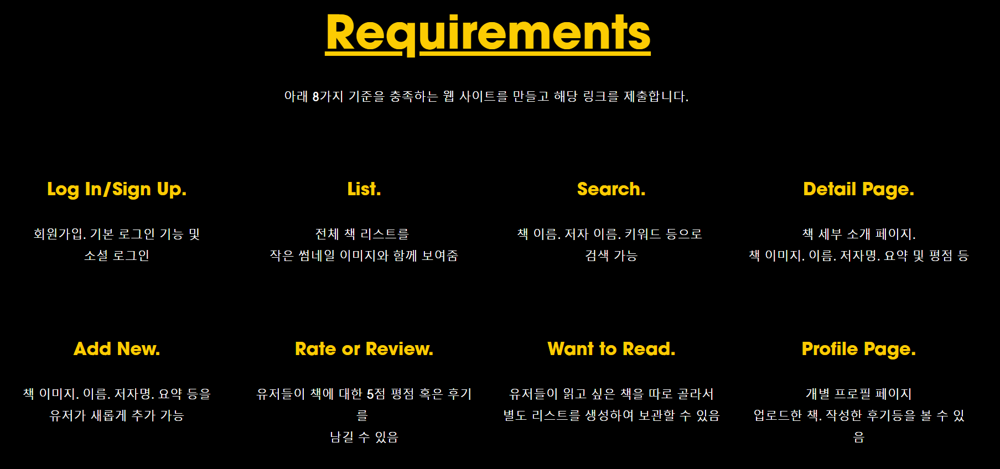

# NOMAD hackaton 출품작 ~29
목표: 한국 버전의 “GoodReads 클론” 만들기  
👉🏻 자세히 보기: https://hackathon.nomadcoders.co/ 

## 기능정리

## 기술스택
* Infra : HEROKU, STORAGE: AWS S3
* 개발 언어 : Nodejs
* Backend : Express.js
* Frontend : ReactJS
* DBMS : mongoDB

## 이외의 기술
* prettier를 통한 코드스타일 정리 (default 값으로 정리)
* Google 애널리틱스를 통한 접속자 수 확인
* S3를 heroku에 넣어 인프라 관리 (secret vars 등) 

## 구현(로컬 기준)
* 로그인 구현 : 구현 (소셜로그인: 구글)
* 리스트 : 구현
* 검색 : 구현중
* 디테일 : 구현
* ADD NEW : 구현
* RATE and REVIEW : 구현
* WANT to read : 구현
* Profile page : 구현중

## How to Run
1) git clone this repository
2) npm install with "node": "12.13.1","npm": "6.13.4" (my env)
3) cd client & npm install
4) cd .. & make dev.js
5) make config/dev.js -> write google, awsS3 key
6) npm run dev
